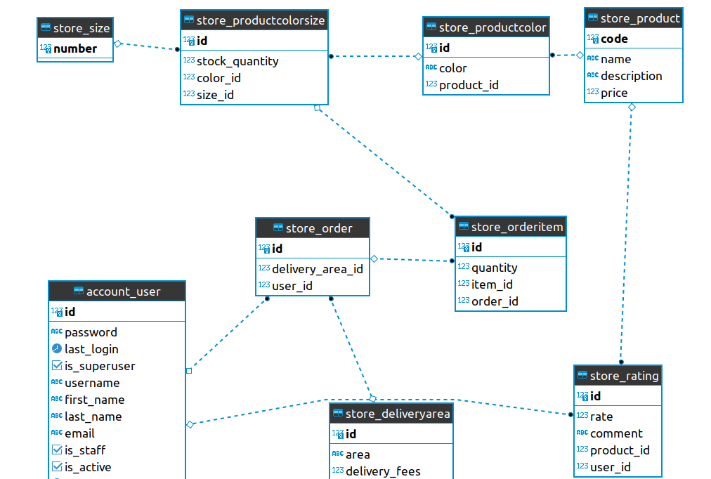

# MOUNT SHOES APIs

## DB SCHEMA



## SETUP

### DATABASE SETUP

```bash
sudo mysql -p
# Type in your password
```

In mysql shell issue the following commands to create a new db and new user:

```mysql
CREATE DATABASE store_db;

CREATE USER 'mount_shoes'@'localhost' IDENTIFIED WITH mysql_native_password BY 'Awesome_password1$';

GRANT ALL ON store_db.* TO 'mount_shoes'@'localhost';

FLUSH PRIVILEGES;
```

### DJANGO SETUP

1. If you created a database with the commands above just copy the example env file,  
   if you changed anything you will need to update the env file with the values you changed.

```bash
cp .env-example .env
```

2. create a new virtual environment and activate it:

```bash
python3 -m venv env
source env/bin/activate
```

3. Install the requirements from requirements.txt file:

```bash
pip install -r requirements.txt
```

## RUN MIGRATIONS

```bash
python manage.py migrate
```

## LOAD DATA

```bash
python manage.py loaddata data/initial.json
```

## RUN SERVER

```bash
python manage.py runserver
```

## BRANCHING

1. Checkout master branch

```bash
git checkout master
```

2. Pull latest changes from the remote repo (github repo)

```bash
git pull
```

3. Create new branch, give it a descriptive name

```bash
git checkout -b "some-branch-name"
```

4. Create files and write code as you want
5. Commit your changes as usual
6. After commiting the changes to push them to the remote repo (github repo) for the first time

```bash
git push -u origin "some-branch-name"
```

    Note: you will use the same branch name here

7. If you wanted to make new changes, do them and commit again then push them

```bash
git push
```

8. When you want to merge your branch to master, create a pull request in [github](https://github.com/wegdanhatem/mount_shoes/pulls)

## ENDPOINTS

- Login

  - URL Path: _/users/login/_
  - HTTP Method: _POST_

- Logout

  - URL Path: _/users/logout/_
  - HTTP Method: _POST_

- Registration

  - URL Path: _/users/_
  - HTTP Method: _POST_

- Change password

  - URL Path: _/users/\<int:id>/password/change/_
  - HTTP Method: _POST_

- Reset password

  - URL Path: _/users/\<int:id>/password/reset/_
  - HTTP Method: _POST_

- Confirm reset password

  - URL Path: _/users/\<int:id>/password/reset/\<str:uidb64>/\<str:token>/_
  - HTTP Method: _POST_

- Get Logged in user profile

  - URL Path: _/users/\<int:id>/_
  - HTTP Method: _GET_
  - Should also contain all products user have ordered before

- Get user's orders

  - URL Path: _/users/\<int:id>/orders/_
  - HTTP Method: _GET_

- List all products

  - URL Path: _/products/_
  - HTTP Method: _GET_

- Get specific product by id

  - URL Path: _/products/\<int:id>/_
  - HTTP Method: _GET_

- Create order

  - URL Path: _/orders/_
  - HTTP Method: _POST_
  - Body:

    ```json
    {
      "items": [
        {
          "item_id": 23432,
          "quantity": 2
        },
        {
          "item_id": 23433,
          "quantity": 1
        }
      ],
      "delivery_area": 1,
      "created_at": "2022-02-20T12:34:34Z",
      "status": "pending"
    }
    ```

  - Response: Order object

- Give rating
  - URL Path: _/products/\<int:id>/rate/_
  - HTTP Method: _POST_
 
 -Paypal endpoint

## PAYPAL INTEGRATION

- Install ngrok

```bash
curl -s https://ngrok-agent.s3.amazonaws.com/ngrok.asc | sudo tee /etc/apt/trusted.gpg.d/ngrok.asc >/dev/null &&
              echo "deb https://ngrok-agent.s3.amazonaws.com buster main" | sudo tee /etc/apt/sources.list.d/ngrok.list &&
              sudo apt update && sudo apt install ngrok
```

- Run ngrok

```bash
ngrok http 8000
```

- Take the https url created in terminal and add it to [paypal](https://developer.paypal.com/developer/applications/edit/SB:QVNUMnQyeHVhdWlvYnRNOWMtSWVlNTlxeV8xYXRoZlpybFFteGRYNVRvMWE0UUlMT18wMEQ0TnlFU2JzUU1lYTZVSjJpV01RYkl2OU1uWTc=)
  You will need to edit the link at the bottom of the page with the new link
